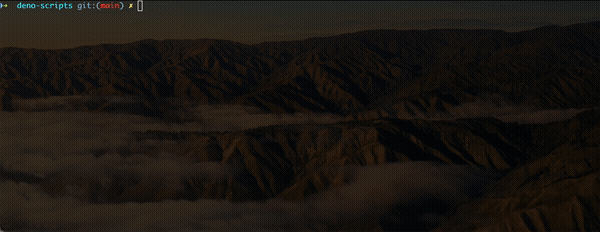

# Deno Scripts

> The purpose of this repo is to create some useful scripts using [Deno](https://deno.land/) runtime.
>
> Deno is a simple, modern and secure runtime for JavaScript and TypeScript that uses V8 and is built in Rust.

## Compress Files

Small script for compressing each file to a zip file, please modify the `sourceFolder`,  `targetFolder`
and `FILE_EXTENSION`. All the original files will be compressed in the `targetFolder`.

This won't run in other operating systems besides MacOS since it's using `Deno.run`. 

#### Run:

```console
$ deno run --allow-read --allow-run compress_files.ts
```

#### Output

```console
  ...
  adding: Bonk's Revenge (U).pce (deflated 33%)

  adding: Blazing Lazers (USA).pce (deflated 47%)
  ...
```

#### Resources:

* Source File - [compress_files.ts](compress_files.ts)

## Chuck Norris

Retrieves a random quote from [https://api.chucknorris.io/](https://api.chucknorris.io/).

#### Run:

```console
$ deno run --allow-net chuck_norris.ts
```

#### Output

```console
Chuck Norris' avatar is actually shorter than him.
```

#### Resources:

* Source File - [chuck_norris.ts](chuck_norris.ts)

## OTP

Generates a time based one-time password for a given secret at the current time.

For this to work, make sure you define an environment variable `TOTP` with the secret or use a `.env` and define
a `TOTP` property.

#### Run:

```console
$ deno run --allow-read --allow-env otp.ts
```

#### Output

```console
219323
```

#### Resources

* Source File - [otp.ts](otp.ts)

## Worten Check Products

Web-Scrapper for [Worten.pt](https://www.worten.pt) web site products.

Make sure you have a file with the product links (one per line), check [products.txt](products.txt) as an example.

#### Run:

```console
$ deno run --allow-net --allow-read worten_check_products.ts products.txt
```

#### Output



#### Resources

* Source File - [worten_check_products.ts](worten_check_products.ts)
* Products - [products.txt](products.txt)
